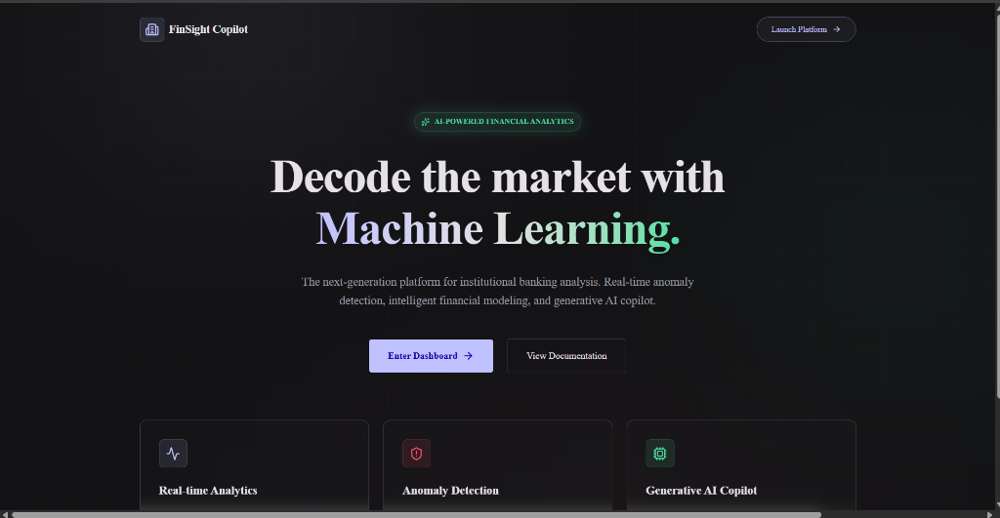
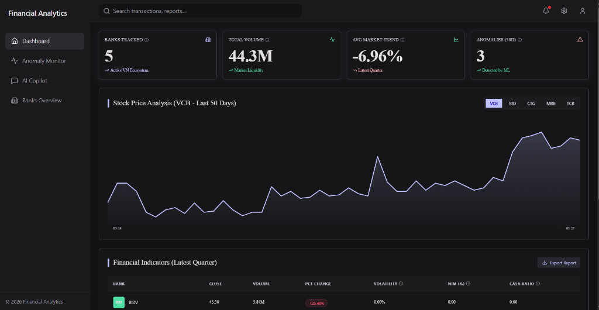
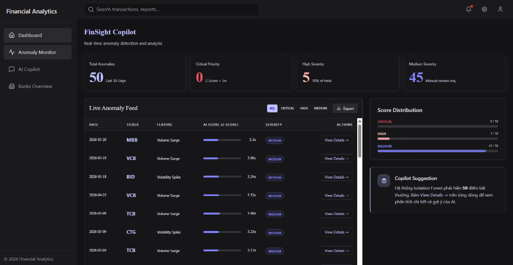
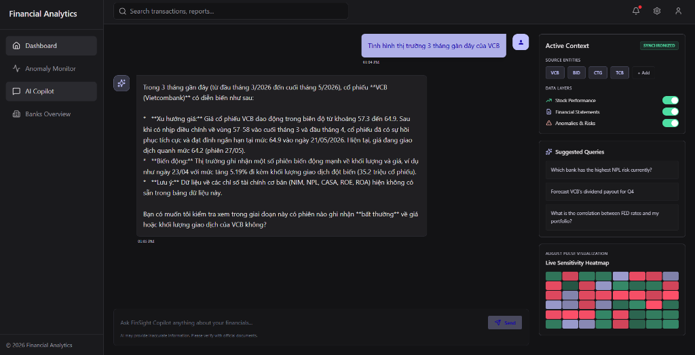
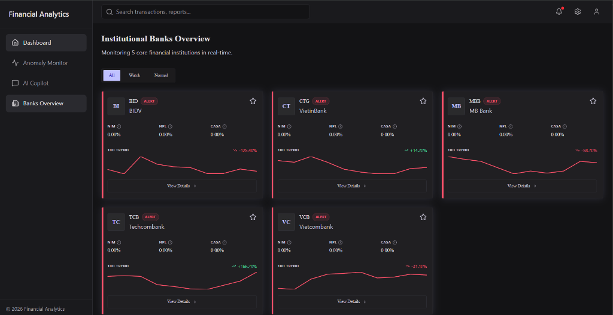
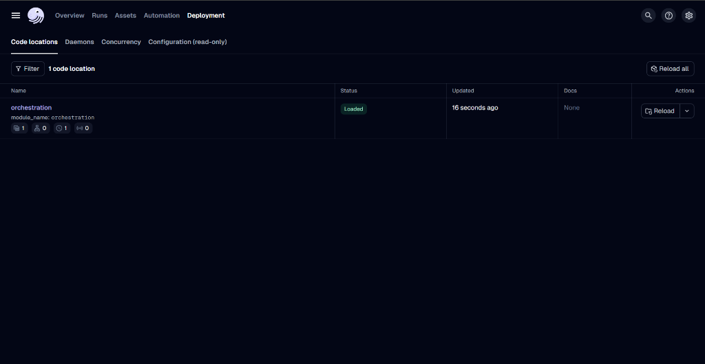
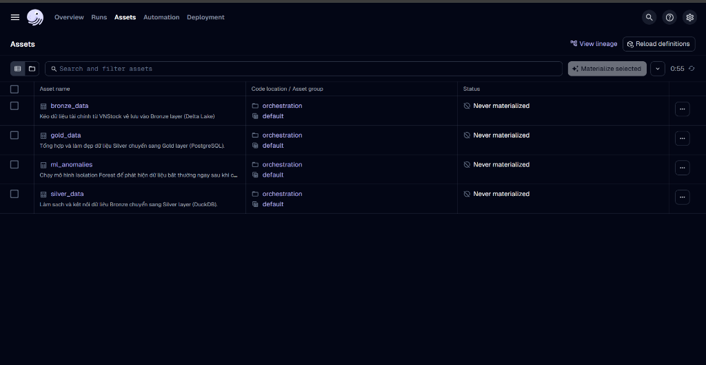

<div align="center">

# 📈 FinSight Copilot

**Your Intelligent AI-Powered Financial Analytics Assistant for the Vietnamese Stock Market.**

[](https://www.python.org/)
[](https://duckdb.org/)
[](https://dagster.io/)
[](https://langchain.com/langgraph)
[](https://opensource.org/licenses/MIT)

</div>

---

## 🖼️ Screenshots

<table>
  <tr>
    <td colspan="2" align="center">
      <strong>🏠 Landing Page</strong><br/>
      
    </td>
  </tr>
  <tr>
    <td align="center">
      <strong>📊 Dashboard</strong><br/>
      
    </td>
    <td align="center">
      <strong>🚨 Anomaly Monitor</strong><br/>
      
    </td>
  </tr>
  <tr>
    <td align="center">
      <strong>🤖 AI Copilot</strong><br/>
      
    </td>
    <td align="center">
      <strong>🏦 Banks Overview</strong><br/>
      
    </td>
  </tr>
</table>

---

## 🎯 Giới thiệu (Overview)

**FinSight Copilot** là một hệ thống phân tích tài chính toàn diện áp dụng kiến trúc dữ liệu **Medallion (Bronze - Silver - Gold)** kết hợp cùng trí tuệ nhân tạo.

Giá trị cốt lõi của dự án là biến những dữ liệu tài chính khổng lồ, rời rạc thành các phân tích dễ hiểu thông qua **Machine Learning** (phát hiện bất thường) và một **Trợ lý Ảo AI (LLM Agent)** có khả năng giao tiếp bằng tiếng Việt tự nhiên. Thay vì phải tự viết SQL hay vẽ biểu đồ, bạn chỉ cần hỏi, FinSight sẽ trả lời.

## ✨ Tính năng nổi bật (Core Features)

- 📊 **Automated Data Pipeline:** Tự động thu thập, làm sạch và lưu trữ dữ liệu chứng khoán Việt Nam (VNStock) & Vĩ mô (WorldBank) bằng kiến trúc Delta Lake & DuckDB.
- 🤖 **AI Anomaly Detection:** Tích hợp mô hình _Isolation Forest_ và _LSTM Autoencoder_ để tự động quét và cảnh báo các phiên giao dịch bất thường (bơm xả, biến động mạnh).
- 🧠 **LangGraph Copilot:** Trợ lý ảo sử dụng model LLM (Gemini/OpenAI) có khả năng tự động viết SQL truy vấn DuckDB để phân tích số liệu theo câu hỏi của bạn.
- ⏱️ **Dagster Orchestration:** Lập lịch tự động hóa toàn bộ quy trình (chạy lúc 16:00 hàng ngày) với giao diện quản lý trực quan.
- 🌐 **Modern Dashboard:** Giao diện Web hiện đại với React, Vite & TailwindCSS tích hợp dữ liệu thực từ DuckDB.

## 👥 Đối tượng người dùng (Target Audience)

- **Nhà đầu tư cá nhân / Chuyên gia phân tích:** Cần một công cụ để soi chiếu sức khỏe tài chính của các ngân hàng (VCB, BID, MBB...) nhanh chóng.
- **Data Engineers / Data Scientists:** Muốn tham khảo một dự án thực tế kết hợp hoàn hảo giữa Data Engineering (Dagster, DuckDB) và AI/ML.

---

## 🛠️ Tech Stack

| Category             | Technologies                                    |
| :------------------- | :---------------------------------------------- |
| **Frontend**         | React, Vite, TypeScript, TailwindCSS            |
| **Backend API**      | FastAPI, Python                                 |
| **Data Warehouse**   | DuckDB, Delta Lake                              |
| **Orchestration**    | Dagster                                         |
| **Machine Learning** | PyTorch (LSTM), Scikit-learn (Isolation Forest) |
| **AI Agent**         | LangGraph, LangChain, Google Gemini Flash Lite  |
| **Data Ingestion**   | Python, Pandas, VNStock API                     |

---

## 🚀 Hướng dẫn cài đặt (Installation)

### Prerequisites

- Python 3.10 hoặc cao hơn.
- Node.js 18+ (cho Frontend).
- Git.
- Tài khoản Google AI Studio (để lấy API Key cho Gemini).

### 1. Clone kho lưu trữ

```bash
git clone https://github.com/conluoi123/financial_analytics_copilot.git
cd financial_analytics_copilot
```

### 2. Cài đặt thư viện Backend

Khuyến nghị sử dụng môi trường ảo (Conda hoặc venv):

```bash
conda create -n finsight python=3.11
conda activate finsight
pip install -r requirements.txt
pip install langchain-google-genai
```

### 3. Cấu hình biến môi trường

Tạo file `.env` ở thư mục gốc và thêm API Key của bạn:

```env
GOOGLE_API_KEY="AIzaSy_YOUR_GEMINI_API_KEY_HERE"
```

### 4. Cài đặt & chạy Frontend

```bash
cd frontend
npm install
npm run dev
```

### 5. Chạy Backend API

```bash
# Tại thư mục gốc
python -m backend.api.server
```

Truy cập `http://localhost:5173` để xem giao diện.

---

## 💡 Cách sử dụng cơ bản (Usage)

### 1. Chat với AI Copilot

Truy cập trang **AI Copilot** trên giao diện web và đặt câu hỏi bằng tiếng Việt:

> **Ví dụ:** _"Hãy cho tôi biết mã VCB dạo gần đây có gì bất thường không?"_

### 2. Theo dõi Pipeline tự động (Dagster)

Mở giao diện quản lý Pipeline:

```bash
dagster dev -m orchestration
```

Truy cập `http://localhost:3000` để xem sơ đồ dữ liệu và bật lịch chạy tự động.

<table>
  <tr>
    <td align="center">
      <strong>⚙️ Dagster Deployment — Code Locations</strong><br/>
      
    </td>
    <td align="center">
      <strong>📦 Dagster Assets — Medallion Pipeline</strong><br/>
      
    </td>
  </tr>
</table>

### 3. Phát hiện bất thường

Vào trang **Anomaly Monitor** để xem danh sách các phiên giao dịch bất thường được phát hiện bởi mô hình Isolation Forest, lọc theo mức độ nghiêm trọng (CRITICAL / HIGH / MEDIUM).

---

## 📂 Cấu trúc thư mục (Project Structure)

```text
financial_analytics_copilot/
├── backend/          # Backend API & LangGraph Agent (Trợ lý AI)
├── data/             # Nơi chứa data local (Bronze/Silver/Gold, DuckDB)
├── docs/             # Tài liệu & screenshots
├── finsight/         # Core data transformations (dbt/pandas logic)
├── frontend/         # React + Vite Dashboard UI
├── ml/               # Machine Learning (Isolation Forest, LSTM)
├── orchestration/    # Dagster schedules & assets định nghĩa quy trình
├── scripts/          # Các script chạy thủ công (run_bronze, run_silver)
├── tests/            # Unit tests cho hệ thống
└── .env              # Biến môi trường chứa API Key
```

---

## 🤝 Đóng góp (Contributing)

Mọi đóng góp đều được chào đón! Vui lòng thực hiện theo các bước sau:

1. Fork dự án này.
2. Tạo một nhánh mới (`git checkout -b feature/AmazingFeature`).
3. Commit các thay đổi của bạn (`git commit -m 'Add some AmazingFeature'`).
4. Push lên nhánh đó (`git push origin feature/AmazingFeature`).
5. Mở một Pull Request.

---

## 📄 Bản quyền (License)

Dự án được phân phối dưới giấy phép MIT License. Xem file `LICENSE` để biết thêm chi tiết.

---

## 📬 Liên hệ (Contact)

- **Tác giả:** [Tên của bạn / Conluoi123]
- **Project Link:** [https://github.com/conluoi123/financial_analytics_copilot](https://github.com/conluoi123/financial_analytics_copilot)
